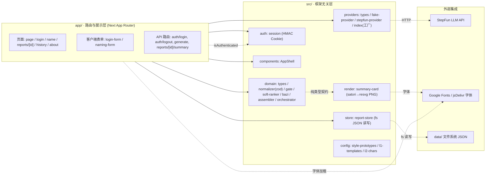
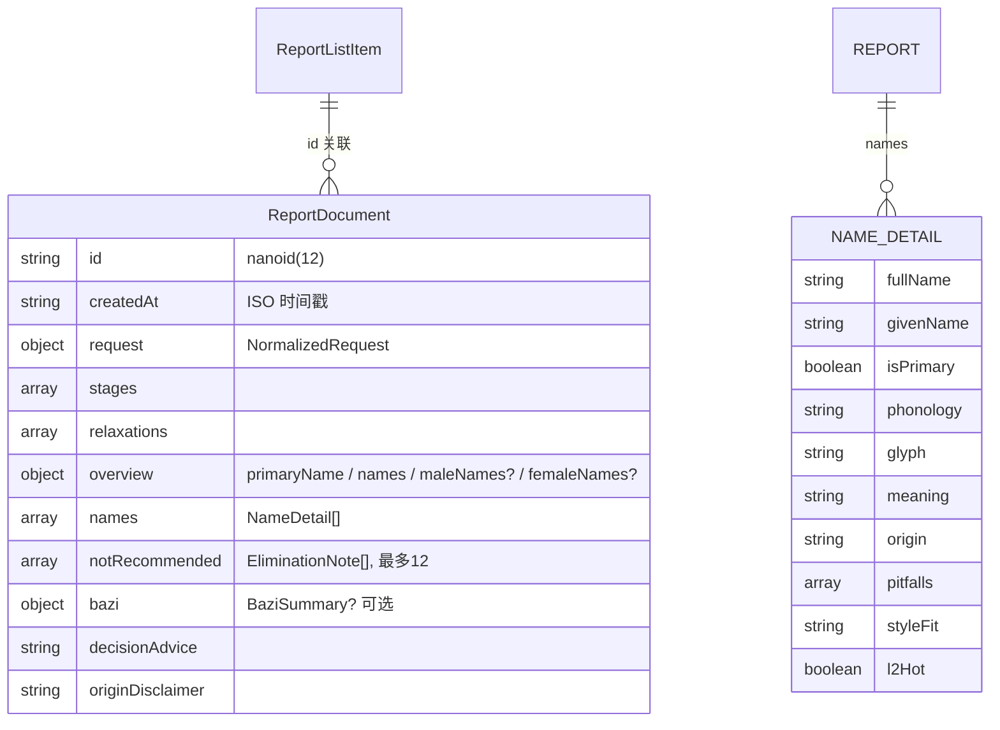
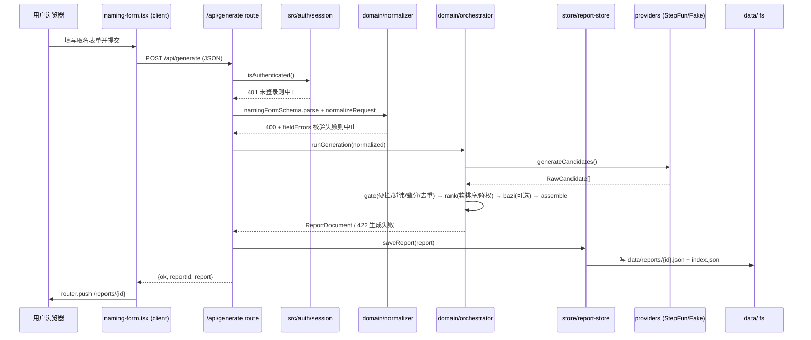

# 瑾瑜 (jinyu) 项目结构总览

```
生成时间: 2026-08-03 12:23 UTC+08:00   基于 commit: 非 Git,以扫描时间为准   预算档位: 小仓
关注重点: 无,均匀全景
覆盖范围:
  已深入: 架构分层、数据模型与持久化、页面/API 路由、认证权限、构建测试文档、docs/ 与 issues/ 文档体系
  未深入: src/render/summary-card.tsx 的字体加载细节、L1/L2 名单具体内容、StepFun 与 DeepSeek 的基准脚本运行结果、data/llm-bench-* 评测报告
```

## 概览摘要

「瑾瑜」是一个**宝宝取名网页应用**。用户登录后填写姓氏、性别、出生状态、名字字数、风格偏好等信息，后端调用 LLM（StepFun）生成候选名，经「网红名硬拦 / 避讳字 / 辈分字 / 去重」等硬规则过滤和软规则排序，产出正式命名报告；报告可在线查看、可下载成一张 PNG 摘要图，并留存在本地历史里回看。

关键事实：

- 技术栈：Next.js 15 (App Router) + React 19 + TypeScript + Tailwind；图像用 satori + @resvg/resvg-js 服务端渲染；pnpm 管理依赖。
- 架构：`app/` 只管路由与展示，业务全在 `src/` 的框架无关层（纯逻辑 domain / LLM providers / render 出图 / store 文件持久化 / auth 会话 / config 静态名单）。
- 数据：**无数据库**，纯文件系统 JSON——报告存 `data/reports/{id}.json`，列表索引存 `data/index.json`。
- 认证：自定义 HMAC-SHA256 签名 Cookie（`jinyu_session`），凭据来自环境变量，单账号应用。
- 状态：MVP 已全量落地——14 个 issue 全部 done，14 条单测 + 1 条金路径 e2e 通过；**非 Git 仓库、无 CI/CD**。
- 文档齐全：README + HANDOFF（交接说明）+ docs/（PRD/TECH/UI/INTENT）+ issues/（14 个工单）。

---

## 0. 基本信息

| 项 | 值 | 可信度 |
|---|---|---|
| 项目名 | jinyu（产品名「瑾瑜」） | 【已核实: package.json】 |
| 版本 | 0.1.0, private | 【已核实: package.json】 |
| 定位 | 宝宝取名报告生成应用（0→1 已落地） | 【已核实: README.md / docs/INTENT】 |
| 仓库 | 非 Git 仓库（无 .git），无版本控制 | 【已核实: 目录检查】 |
| 状态 | MVP 全量完成，14 issue 全 done，单测/e2e/build 通过 | 【已核实: HANDOFF.md】 |
| 依赖管理 | pnpm（pnpm-lock.yaml） | 【已核实: pnpm-lock.yaml】 |

## 1. 一句话概述

一个单账号的宝宝取名 Web 应用：登录 → 填宝宝信息 → LLM 生成候选名 → 硬/软规则筛选 → 产出正式命名报告（可下载 PNG 摘要图）→ 历史回看。

## 2. 技术栈

| 层 | 技术 | 证据 |
|---|---|---|
| 框架 | Next.js 15.1.0 (App Router) | 【已核实: package.json deps】 |
| UI | React 19 + TypeScript 5.7 + Tailwind CSS 3.4 | 【已核实: package.json】 |
| 图像渲染 | satori 0.12（JSX→SVG）+ @resvg/resvg-js 2.6（SVG→PNG） | 【已核实: package.json + src/render/summary-card.tsx】 |
| 校验 | zod 3.24（仅表单输入 schema） | 【已核实: src/domain/normalizer.ts】 |
| ID | nanoid 5（报告 id = nanoid(12)） | 【已核实: src/domain/assembler.ts】 |
| LLM | StepFun（OpenAI 兼容 Chat Completions），另有 FakeProvider（测试/无网）；DeepSeek 仅 bench 脚本用 | 【已核实: src/providers/*】 |
| 持久化 | Node fs 读写 JSON 文件，无数据库 | 【已核实: src/store/report-store.ts】 |
| 认证 | node:crypto HMAC-SHA256 签名 Cookie，无第三方 auth 库 | 【已核实: src/auth/session.ts】 |
| 单测 | Vitest 2（纯 node 环境，无 jsdom） | 【已核实: vitest.config.ts】 |
| E2E | Playwright（chromium 单浏览器，webServer 起 dev） | 【已核实: playwright.config.ts】 |
| 字体 | Google Fonts Noto Serif SC（页面）+ jsDelivr 拉 woff（出图） | 【已核实: app/layout.tsx / src/render/summary-card.tsx】 |

## 3. 架构分层 / 模块地图

分层清晰：`app/`（Next 路由层：入口、页面、守卫、客户端表单）只做编排与展示，业务逻辑全在 `src/` 的框架无关层。`src/store` 是**文件系统持久化层**，不是 React 状态管理（客户端无任何状态库，纯 useState + router）。



> 实线=已核实依赖；虚线（`-.`）=已核实的轻量耦合/外部 IO。【已核实: 各 src 子目录文件 + app 路由】

## 4. 核心功能

| 功能 | 说明 | 关键位置 |
|---|---|---|
| 登录/登出 | 环境变量预设单账号，HMAC cookie 会话，30 天 | 【已核实: app/api/auth/login、logout/route.ts, src/auth/session.ts】 |
| 取名生成 | 表单→校验归一化→LLM 候选→硬门禁→软排序→可选八字摘要→组报告 | 【已核实: app/api/generate/route.ts, src/domain/orchestrator.ts】 |
| 候选筛选 | L1 网红名硬拦、避讳字/辈分字/字数/去重硬规则；L2 热门字降权排序 | 【已核实: src/domain/gate.ts, soft-ranker.ts, src/config/l1-templates.json, l2-chars.json】 |
| 八字摘要 | 按生日时辰做确定性排盘（克制式，非专业引擎） | 【已核实: src/domain/bazi.ts】 |
| 报告展示 | 总览/逐名详解/不推荐/八字/决策建议/免责声明 | 【已核实: app/reports/[id]/page.tsx, src/domain/assembler.ts】 |
| 摘要图下载 | 报告渲染成 720×960 PNG 附件下载 | 【已核实: app/api/reports/[id]/summary/route.ts, src/render/summary-card.tsx】 |
| 历史回看 | 报告索引列表，可回单份报告 | 【已核实: app/history/page.tsx, src/store/report-store.ts】 |

## 5. 关键入口

**页面路由**（app/ 下，除根布局外无独立 layout）：

| 路径 | 文件 | 说明 | 守卫 |
|---|---|---|---|
| `/` | app/page.tsx | 按登录态 redirect 到 /name 或 /login | 有 |
| `/login` | app/login/page.tsx | 登录页（含 login-form.tsx） | 反向（已登录→/name） |
| `/name` | app/name/page.tsx | 取名表单（含 naming-form.tsx） | 有 |
| `/reports/[id]` | app/reports/[id]/page.tsx | 报告详情 + 下载图/历史/再取入口 | 有 |
| `/history` | app/history/page.tsx | 历史报告列表 | 有 |
| `/about` | app/about/page.tsx | 命名理念静态页 | 有 |

**API 路由**：

| 方法 | 路径 | 入参 | 出参/行为 | 鉴权 |
|---|---|---|---|---|
| POST | /api/auth/login | `{username, password}` | 设 `jinyu_session` cookie，成功 `{ok:true}` | 无（登录本身） |
| POST | /api/auth/logout | 无 | 清 cookie，303→/login | 无 |
| POST | /api/generate | `NamingFormInput` JSON | `{ok, reportId, report}`，落盘；400 校验失败+fieldErrors / 422 生成失败 | 需登录 401 |
| GET | /api/reports/[id]/summary | URL id | 返回 PNG 附件下载 | 需登录 401 |

【已核实: 上述 route.ts 逐一读取】

## 6. 数据模型概览

**无数据库，纯文件系统 JSON。** 报告全文存 `data/reports/{id}.json`（文件名 = nanoid(12) id），列表索引 `data/index.json`（数组）。领域类型是纯 TS 接口（`src/domain/types.ts`），**zod 仅校验表单输入**（`src/domain/normalizer.ts` 的 `namingFormSchema`），报告等核心对象无运行时校验。



核心类型字段【已核实: src/domain/types.ts + data/reports/09QubUSKAOj3.json 实样】：
- `Gender = male|female|unknown`；`BirthStatus = born|unborn|uncertain`；`NameLengthMode = two|one`；`GenerationCharPosition = first|second|any`
- `NamingFormInput`（表单原始输入）→ `normalizeRequest` → `NormalizedRequest`（含 `surname 1-2 字`、`tabooChars: string[]`、`stylePrototypeId`、`avoidPopular` 等）
- `ReportDocument` = 报告全文（见上 ER 图）；`ReportListItem` = 索引项（id/createdAt/surname/gender/nameSummary）

数据读写全部在 `src/store/report-store.ts`（`DATA_DIR = JINYU_DATA_DIR || cwd/data`）：`saveReport` 写报告文件 + 索引头部插入；`getReport`/`listReports` 供 API 和 server 页面读取。

## 7. 外部依赖与集成

| 依赖 | 用途 | 证据 |
|---|---|---|
| StepFun LLM API | 生成取名候选（OpenAI 兼容 Chat Completions），base url/model/key 来自环境变量 | 【已核实: src/providers/stepfun-provider.ts】 |
| Google Fonts | 页面加载 Noto Serif SC（preconnect + stylesheet） | 【已核实: app/layout.tsx】 |
| jsDelivr | 出图时拉取 Noto Serif SC woff（satori 需要），失败回退第二字体源 | 【已核实: src/render/summary-card.tsx】 |
| DeepSeek API | **仅 bench 脚本**使用（`DEEPSEEK_*` 环境变量，不在 .env.example），未接入 app 内 provider | 【已核实: scripts/bench-deepseek-only.mjs + HANDOFF.md】 |

## 8. 构建·运行·测试

- 运行：`pnpm install` → `pnpm dev`（开发）；`pnpm build` + `pnpm start`（生产）。next.config.ts 仅一行 `serverExternalPackages: ["@resvg/resvg-js"]`，无 rewrites/images/output 特殊配置。【已核实】
- 配置：先 `cp .env.example .env.local` 并填值（认证 + LLM 键）。【已核实: README.md】
- 单测：`pnpm test`（vitest run）。`tests/` 下 4 个文件全走 Fake LLM：`normalizer/gate/orchestrator/store` 单测，14 条全过。【已核实: tests/*.test.ts + HANDOFF.md】
- E2E：`pnpm e2e`（playwright test）。`e2e/golden-path.spec.ts` 一条金路径：登录→填表→报告→下载图→历史；webServer 自动起 `pnpm dev` 并强制 `LLM_USE_FAKE=true` + 预设 auth 环境变量；chromium 单浏览器、单 worker。【已核实: playwright.config.ts】
- typecheck/lint：`pnpm typecheck`（tsc --noEmit）/ `pnpm lint`。
- 部署：**无任何部署配置**（无 Dockerfile / CI workflow / vercel 等），非 Git 仓库。【已核实: 全树搜索】

## 9. 风险区域

只描述现状，不给修改方案。

| 风险 | 性质 | 证据 |
|---|---|---|
| 认证凭据有公开可知的默认兜底：`JINYU_AUTH_USERNAME`/`JINYU_AUTH_PASSWORD` 未设置时 fallback 固定账号 | **默认弱凭证**（未脱敏，仅记键名） | 【已核实: src/auth/session.ts:17-18】 |
| 签名密钥 `JINYU_SESSION_SECRET` 未设置时 fallback 硬编码 dev 密钥 | **硬编码凭证** | 【已核实: src/auth/session.ts:8】 |
| 密码比对用 `===` 普通字符串比较，非常时安全比较 | 时序侧信道 | 【已核实: src/auth/session.ts:24】 |
| Session 自包含（token 无服务端失效机制），登出仅清 cookie，已签发 token 在 30 天 exp 内可重放 | 登出不失效 | 【已核实: src/auth/session.ts】 |
| cookie `secure` 仅生产环境为 true，开发环境明文 HTTP | 传输安全 | 【已核实: src/auth/session.ts:35】 |
| `/api/auth/login` 无速率限制/防爆破逻辑（固定单账号可被暴力尝试） | 【推断: 全项目无节流代码】 | 【推断: grep 未命中】 |
| 登录表单无 CSRF token，缓解仅依赖 cookie sameSite=lax | 【已核实: login-form.tsx】 |
| 报告按 id 读盘，仅要求「已登录」，无用户级隔离 | 单账号设计内，非缺陷 | 【已核实: report-store.ts】 |
| `next@15.1.0` 安装时被 pnpm 警告废弃/安全 | 依赖陈旧 | 【已核实: HANDOFF.md】 |
| `.env.local` 中 key 曾出现在聊天记录，HANDOFF 建议轮换 | 凭证泄露隐患 | 【已核实: HANDOFF.md】 |
| 非 Git 仓库，无版本控制/回滚能力 | 工程风险 | 【已核实: 目录检查】 |
| 摘要图渲染在最新 UI 改动后未复验 | 回归风险 | 【已核实: HANDOFF.md】 |

## 10. 权限 / 认证模型概览

- 机制：**自定义 HMAC-SHA256 签名 Cookie Session**（无第三方 auth 库）。`jinyu_session` cookie，httpOnly / sameSite=lax / secure(仅生产) / 30 天。【已核实: src/auth/session.ts】
- 凭证：环境变量 `JINYU_AUTH_USERNAME`/`JINYU_AUTH_PASSWORD`，明文常量比对。【已核实】
- **认证链路选取的字段**：cookie `jinyu_session` 的有效签名 + exp 未过期（session payload = `{u:"preset", exp}`，用户名硬编码 "preset"）【已核实: session.ts:29】
- **鉴权链路使用的字段**：`isAuthenticated()` 布尔结果——仅校验 cookie 签名有效性与过期时间；API 守卫在 generate/summary route 内返回 401，页面守卫在各 server 组件内 `redirect("/login")`；无 middleware。【已核实】
- **一致性自检结论**：鉴权使用的字段（cookie 签名有效性）⊆ 认证链路选取字段（同一 cookie 校验结果），**一致，无不匹配**。附注：payload 中 `u:"preset"` 是硬编码字面量，下游鉴权从未读取用户名/角色字段——系统为单账号设计。【已核实: 源码比对】
- `requireAuth()` 为 `isAuthenticated()` 的别名，全项目未被引用。【已核实】

## 11. 典型主流程

代表性链路：**取名生成一次报告**（POST /api/generate）。



【已核实: 各步骤文件逐一读取】。下载摘要图为支线：GET /api/reports/[id]/summary → `getReport(id)` → `renderSummaryCardPng`（satori→resvg）→ PNG 附件。

## 12. 文档与知识入口

| 文档 | 内容 | 证据 |
|---|---|---|
| README.md | 产品介绍 + 快速上手（配置/命令/默认账号） | 【已核实】 |
| HANDOFF.md | **交接说明书**：已完成项、已知风险、已定决策、遗留事项 | 【已核实】 |
| docs/PRD.md | 产品需求文档（ready-for-agent） | 【已核实】 |
| docs/TECH.md | 技术选型 + LLM 接入（decided） | 【已核实】 |
| docs/UI.md | 纸笺风格 UI 规范（decided） | 【已核实】 |
| docs/intent/2026-07-23-001-jinyu.md | INTENT 记录：能力表 C01–C36 保留/放弃、决策来源 | 【已核实】 |
| issues/01…14 | 14 个垂直切片工单，全部 Status: done | 【已核实: Grep Status】 |

## 13. 没挖深的部分

未覆盖项（可「再挖 X」扩展）：

- `src/render/summary-card.tsx` 出图的详细布局/样式与字体加载回退实现细节
- `src/config/l1-templates.json` / `l2-chars.json` 名单具体内容与阈值
- StepFun/DeepSeek 基准脚本（`scripts/bench-*.mjs`）的运行结果与 `data/llm-bench-*` 评测报告
- `src/providers/stepfun-provider.ts` 的解析/降级细节（reasoning 抽取等）
- e2e golden-path 与真实 LLM 链路（`scripts/e2e-real-llm.mjs`）的运行时行为未实际跑通验证（按 HANDOFF 记载为通过）

## 14. 代码风格观察

只描述，不给建议。

- 严格类型化：核心领域全部 TS 接口/联合类型，枚举用字符串字面量联合。【已核实: src/domain/types.ts】
- 单一职责小文件：每个领域概念一个文件（gate/ranker/bazi/assembler/orchestrator）。【已核实】
- 服务端组件 + 客户端表单分离：交互组件 `"use client"` 与路由同目录放置（app/login/、app/name/），共享组件放 src/components。【已核实】
- zod 用法克制：仅表单输入一处 schema，领域对象用 TS 类型而非 zod。【已核实】
- 环境变量集中读取：config 类静态数据独立放 src/config；环境变量在 auth/store/providers 各自读取。【已核实】
- 测试命名与结构规整：tests/ 按 domain 模块命名（normalizer/gate/orchestrator/store），e2e 单文件金路径。【已核实】
- 文档与代码同库维护：docs/ + issues/ 完整，HANDOFF 定期更新。【已核实】
- 注释密度低，靠类型与命名表达意图。【已核实: 抽样源码】
